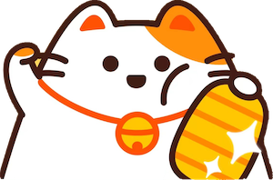

# Genki Cats Core

Genki Cats is a mobile, fully-onchain game based on the [MUD](https://github.com/latticexyz/mud) framework. Players can own their cats, cultivate their unique hobbies, and earn rich on-chain rewards. Through the customization of game engines, Genki Cats achieves a Web2 gaming experience while ensuring the game's permanency and openness.

The game is still under rapid development. Please feel free to raise any issues here.

## Game Features

Given that Genki Cats is constructed with over 20 system contracts and 50 table contracts, we're listing the primary gaming systems and functions below for clearer understanding.

### Users

- [x] User registration
- [x] Bind multiple wallets for users

### Pets

- [x] Adopt a pet
- [x] Off-chain estimation of pet status
- [x] On-chain updates of pet status
- [x] Check for starving pets and the corresponding penalty system
- [x] Pet care system (Feeding, Petting)
- [ ] Pet marriage system
- [ ] Pet birth system

### Home

- [x] Automatic pet feeder system
- [ ] Toy placement system

### Hobby

- [x] Create a custom hobby without needing permission
- [x] Engage in hobby activities
- [x] Claim outputs from hobbies

### Buff

- [x] Design system for buffs
- [x] Effect system for buffs

### Shop

- [x] Item listings
- [x] Limits on daily/weekly/monthly sales
- [x] Purchase items using coins or ERC20 tokens

### Tasks

- [x] Define custom task requirements
- [x] Complete tasks

### General Gaming Components

- [x] Low-cost random system for gaming
- [x] Efficient on-chain weight sampling
- [x] System for leveling up
- [x] Quantity helper system
- [x] System for UID generation
- [x] Offerings with time limits
- [x] Timezone system
